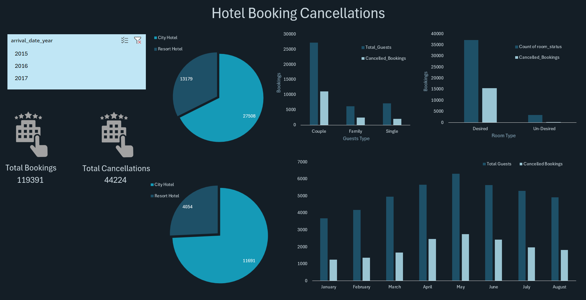

# Hotel Booking Analysis

This project analyzes hotel booking data to identify trends, cancellations, guest behavior, and room preferences. The analysis includes cleaned data, pivot tables, and an interactive Excel dashboard to summarize key insights.

---

## Dashboard Preview

---

## What’s Inside the Report File

`hotel_booking_report.xlsx` contains:

- **Cleaned_Data** — processed dataset ready for analysis  
- **Pivot** — pivot tables used for metrics and visual insights  
- **Dashboard** — interactive Excel dashboard  

---

## 🛠 Tools & Technologies

- **Excel / Power Query** – data cleaning  
- **Pivot Tables & Charts** – analysis  
- **Excel Dashboarding** – visualization  

---

## Key Insights

- Cancellation rate trends across different hotel types  
- Which guest types cancel the most  
- Seasonal booking and cancellation patterns  
- Room preferences (desired vs. non-desired)  
